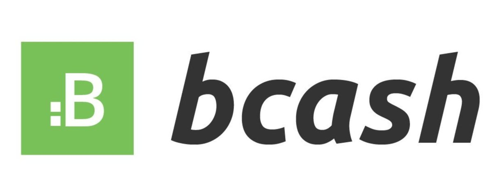

its-bcash
=============

Chrome extension that replaces occurrences of 'Bitcoin Cash' with 'Bcash'

[Direct download of crx file](https://github.com/alp-bitcoin/its-bcash/blob/master/ItsBCash.crx?raw=true) (drag-drop into Chrome "Extensions" tab to install).

[Chrome Plugin Link](https://chrome.google.com/webstore/detail/its-bcash/iihpdfeaoihpfkgmbnmoipjmhlnnhlmke)

This is a fork of [PanicSteve's Cloud-to-Butt
plugin](https://github.com/panicsteve/cloud-to-butt) which aims to disarm
trolling and intentional brand confusion in the Bitcoin and larger crypto realm
by universally replacing any instance of the confusing name "Bitcoin Cash" with the less confusing name "Bcash".

This browser plugin is installed and works in exactly the same fashion as Cloud-to-Butt.

